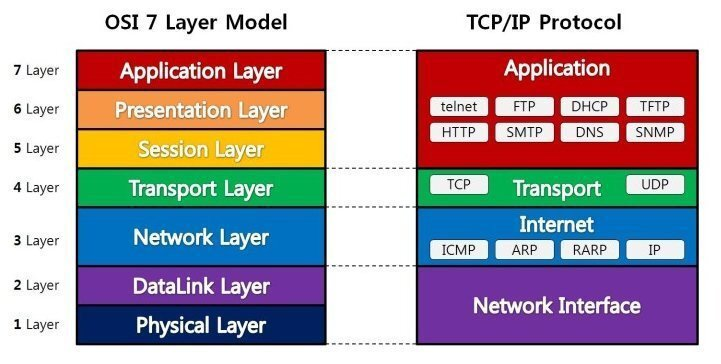
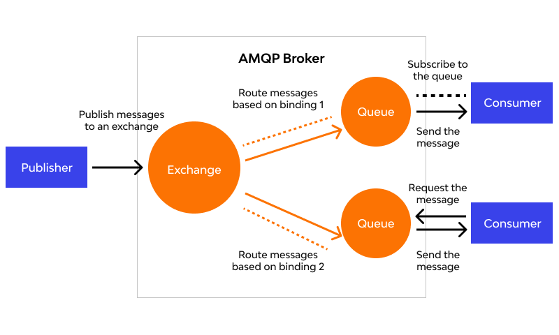
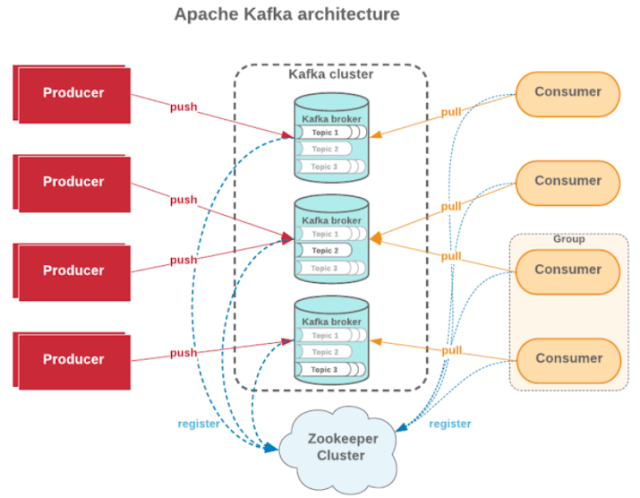

# IPC를 위한 패턴 

## IPC : Inter Process Communication
- 프로세스간 통신 -> 서비스 간 통신 -> MSA

---
- Network 통신이 어떻게 이루어지는지 이해가 필요!
  - OSI 7 계층과 TCP/IP 모델에 대해 이해가 필요하다


#### OSI 7 계층과 TCP/IP 모델



- 한 곳에서 다른 곳으로 통신이 어떻게 되는지 설명하는 모델 
  - 논리적으로 이해하기에는 TCP/IP

## IPC를 위한 패턴 

- 일반적인 IPC는 크게 2가지로 나뉜다. 

- Sync(동기) 방식
  - 고객이 감지하는 시간 (latency)가 긴 편
- Async(비동기) 방식
  - 고객이 감지하는 시간이 짧다


### Sync 방식
- (Restful 방식)HTTP, gRPC(플랫폼 성격의 통신 방식) 방식을 많이 활용

#### 적절한 경우 (적절 할 수도 있는 경우)
- 굉장히 중요한 작업을 하는 경우,
- 비교적 빠른 작업에 대한 요청일 경우
- 선행작업이 필수적인 비즈니스인 경우

#### 부적절한 경우 (일반적으로 부적절한 경우)
- 매우 복잡하고 리소스 소모가 많은 작업의 요청일 경우
- 비교적 한정된 컴퓨팅 리소스를 가지고 있는 경우

### Async 방식
- **Queue**를 활용하여 Produce, Consume 방식으로 데이터 통신을 해요
  - e.x. rabbitMQ, Kafka, pubsub, ...

#### 적절한 경우
- 매우 복잡하고 리소스 소모가 많은 작업의 요청일 경우
- 비교적 한정된 컴퓨팅 리소스를 가지고 있는 경우
  - 그런데, 서버 리소스로 인해 누락이 되면 안되는 경우

- 독립적으로 실행되는 수 많은 서비스들이 있는 대용량 MSA 환경
  - 응답 대기시간을 최소화
  - 느슨하게 결합도를 낮춰, 개발 서비스의 확장성을 유연하게 처리
  - 각 서비스에 문제가 생겼더라도, 복구 시에는 데이터 안정적으로 처리 가능 


## 일반적인 Sync IPC 패턴 1 - HTTP
- OSI 7 응용계층의 통신 프로토콜
- L4계층에서는 tcp 방식을 활용하는 프로토콜 
- 여러가지 종류의 메서드가 존재하지만, 일반적으로 4개의 메서드를 활용 (CRUD)
  - **GET**
    - 리소스를 얻어오기 위한 메서드(Read)
  - **POST**
    - 리소스를 변경(생성) 하기 위한 메서드 (Create)
  - **PUT**
    - 리소스를 변경(생성된 리소스를 변경) 하기 위한 메서드 (Update)
    - **멱등성(Idempotence) 필수**
      - e.x. 한 멤버의 이름을 수정하는 요청을 여러번 요청해도, 서버의 상태는 동일해야 한다.
  - **DELETE**
    - 리소스를 삭제하기 위한 메서드 (Delete)

## 일반적인 Sync IPC 패턴 2 - gRPC

- Protocoal Buffer 라는 것을 기반으로 하는 **원격 프로시저 호출 프레임워크**
  - 모든 데이터 Spec이 사전에 **약속**되어있음을 의미!
    - 사전에 약속되어져 있는 파일을 Proto 라고 한다
  - 일반적으로 Server to Server Call 경우에 한해서 사용
  - 정확히 특정 계층의 프로토콜이라고 하기는 어렵다 (L4~L7)
  - 빠르지만, 번거로운 작업들과 위험이 수반된다.

- 프로토
```text
message Person {
  string name = 1;
  int32 age = 2;
    }
service PersonService {
  rpc GetPerson(GetPersonRequest) returns (PersonResponse);
  rpc CreatePerson(CreatePersonRequest) returns (PersonResponse);
  
    }
```

# Async 방식
- Queue를 활용하여 Produce, Consume 방식으로 데이터 통신을 한다
- 큐를 활용하는 방식을 표준화한 프로토콜로 존재함
- MQTT, AMQP : OASIS 라는 곳에서 표준으로 제정한 표준 프로토콜


#### MQTT(Messaging Queuing Telemetry Transport)
- 경량 메세징 프로토콜로서, IoT 등 경량화가 최대 목적인 프로토콜 
- Publish, Subscribe, Topic 모델 사용
- 스펙이랑 기능이 조금 부족하다

#### AMQP (Advanced Message Queueing Protocol)
- 엔터프라이즈 레벨의 메세징 시스템을 위한 프로토콜 
- MQTT 개념 외에도 , Exchange, Binding 등 개념 추가
- Rabbit MQ, Active MQ , ...
- 주로 이 프로토콜을 사용 한다!

## AMQP(Advanced Message Queueing Protocol) 의 구성요소

- 발행자(Publisher)는 Exchange만 바라본다
- **Exchange 는 Routing 역할!**
- Publisher 는 Exchange만 안다
- AMQP Broker 에 포함된 큐가 어디로 메세지를 보낼지
  - 어디로 보낼지 정하는 것을 binding 이라고 함
- Consumer 방식에서 Pull 과 Push 방식 둘다 가능하다!

---
- 유연하다!
- 유연하기 때문에 퍼포먼스는 조금 떨어진다 


## MQTT 도, AMQP 도 아닌 kafka..?

- Kafka는 링크드인에서 개발한 대용량의 데이터 스트림을 처리하기 위한 분산 스트리밍 플랫폼
- MQTT, AMQP 등의 표준을 구현하는 프로토콜이 아닌, 독립적인 데이터 스트리밍 플랫폼
- 비교적 복잡한 개념들을 가지고 있지만,
  - **성능(메시지 처리량)은 압도적**
  - 고성능, 고용량 메세지 처리를 위해 설계됨
- 많은 회사에서, 그리고 JVM 과의 좋은 궁합으로 상당히 폭넓게 사용되어짐
- 다만, 제대로 사용을 하기 위한 러닝 커브는 꽤 높은 편 
- 다양한 부분을 관리 해야하는 불편함이 있다.


### kafka의 구성요소 



- **Topic** : Producer, Consumer 입장에서의 메세징 객체 
  - 어디어디에 보내, 어디어디로 부터 받아 (어디어디 가 토픽!)
- **Partition** : Topic을 물리적으로 분할하고, 처리
- **Broker** : Kafka 클러스터의 각 노드를 의미 (물리적)
- **Zookeeper** : Kafka 클러스터의 메타 데이터 관리 

- Producer가 데이터를 Push - Push의 주체는 Topic
- 이 토픽이 포함된 파티션들에 복제가 됨 
- 각각의 파티션은 하나의 브로커에 할당이 되고, 
- 이 내부의 토픽의 리더라던가 그런 정보는 Zookeeper가 들고 있으며
- 각각의 토픽안의 데이터를 Comsume 하기 위해 COmsumer 들이 존재
- Group은 Consumer을 여러개 포함하고, 만약 토픽을 받으면 나눠서 동작할 수 있게 된다. 
  - (1,2,3 이라는 데이터가 들어오면, 1,2 를 한 Consumer 가 처리하고 3을 다른 Consumer가 처리한다.)


## Async 통신의 가장 큰 단점 
- Sync 방식은 하나의 Request 에 하나의 Response 만 존재한다


- 하나의 Produce 가 큐잉을 사용해서 하나의 Consume을 보내는 건 불가능하다! 
  - Consume 을 한다는 것은 데이터를 받아서 처리하겠다는 뜻 
    - 가져와서 데이터를 처리한 다음에 처리를 마친 다음 -> 큐에게 처리 끝났다고 알려주는 작업이 Consume이라는 작업 안에 내포 된 작업 

- 하나의 Producer에 대해서 큐잉을 이용해서 한번만 Consume 하는 것은 불가능 
- 왜냐하면 다양한 장애 상황이 있을 수 있다
- 그리고 그 장애 상황들은 그 Consume 이라는 동작에 포함된 오동작을 할 수 있다.
  - Comsume , Handling 그리고 Commit
- 큐의 입장에서는 Consume 이후의 동작이 잘 수행됐는지 안됐는지 알 수 없다

- 큐의 입장에서 2번이상 보낼 수 있다