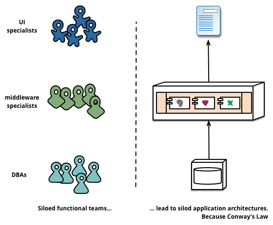
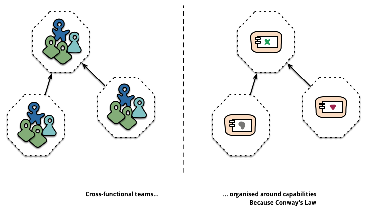

# MSA

### 그래서 모놀리식과 SOA의 문제가 뭔가요? 
- 협업, 커뮤니케이션, 확장성, 유연성, 결합도, 응집도, 빌드와 배포, ....
- **"요구사항 변화에 따른 빠른 대처"** (Business Capability)

### 왜 MSA 를 사용해야할까? 
- 모놀리식 대비 MSA가 어렵고 복잡한 것은 팩트다
- 다만, 과거에는 어렵고 복잡한 것을 해결해 줄 수단들이 부족했다
- 기술의 발전에 따라 어느순간 **"MSA로 인한 고통보다 MSA로 인한 이점이 커졌다."**

# MSA의 핵심 원칙 
- MSA라는 개념과 관련해서 많은 이론들을 만들어낸 마틴파울러가 정의한 MSA의 특징 
  - Componentization via Services
  - **Organized around Business Capabilities**
  - **Products not Projects**
  - Smart endpoints and dumb pipes
  - Decentralized Data Management / Governance
  - Infrastructure Automation
  - **Design for Failurue**
  - Evolutionary Design

[마틴파울러_MSA_링크](https://martinfowler.com/articles/microservices.html#OrganizedAroundBusinessCapabilities)

## Organized around Business Capabilities

### Business Capabilities

- Conway's Law 콘웨이의 법칙
  - `시스템이 설계되면, 그 시스템의 구조는 설계한 조직의 구조와 유사해진다.`

- Business Capabilities 이것을 높이기 위한 목적
  - `조직이 얼마나 빠르고 유연하게 변화에 대응할 수 있는지에 대한 능력`

### Organized around Business Capabilities 

기능 조직
- 회사에서 "기능"을 담당하는 조직으로, 특별한 목적성을 가지지는 않음

목적 조직
- 특정 "목적"을 가진 사내 조직으로서, 명확한 미션과 비전을 가지고 팀의 모든 의사결정이 진행된다.

## Product, Not Project
- Project는 1회성 적인 프로젝트로 이것이 끝나면, 넘겨주는 형식
  - 사용자를 위한게 아니라 고객사를 위한 프로그램
  - 사용자의 어떤 불편함을 수정할 사람들은 소스 코드 개발자가 아니라 유지보수 하는 사람이다.

- Product는 개발자이면서 유지보수하는 개발자, PM 까지 한 팀으로 이루어져서 Business Capabilites 를 높여 유저의 기능을 빠르게 대응 할 수 있다.
  - Inhouse 
  - 이 코드는 내가 만들었으니까 내가 개발해줄께
  - 빠른 대응으로써 Business Capabilities 를 늘리면서 서로 윈윈 할 수 있다.

## Design for Failurue
- 시스템은 언제든지 문제가 생길 수있다.
  - 감지 (e.x. Circuit Breaker) 
    - 기존 모놀리식에서는 존재 안함 (로직에 대해서 ifelse 만 태웠으면 됨)
    - MSA에서는 서비스가 서비스를 호출하기 때문
  - 복구 (e.x. Container Ochestration, K8S) 
  - 의도치 않은 결과 방지 (e.x. Transaction, Event Driven)
  - 서비스 간의 영향도 (e.x. Chaos Test)

## Other
### Smart endpoints and dumb pipes
- 앞에서 처리하는 부분은 최대한 단순하고 뒷단은 스마트 하게 
- RESTful 같은 최대한 단순한 방식의 프로토콜 사용
- 관심의 분리 - Seperation of Concerns
  - 통신단은 통신에 집중하고
  - 복잡한 부분은 뒷단에서 집중하자.

### Decentralized Data Management / Governance
- DB의 분리 , 비즈니스 필요성에 따른 최적의 기술스택을 사용하라
- 데이터의 유연성, 탄력성의 확보
- 비즈니스 필요성에 따른 최적의 기술스택 사용
- 최대한 효율적으로 자원을 사용하자!

### Infrastructure Automation
- CI/CD 파이프라인의 같은 인프라 자동화의 중요성
- 지속적인 통합 / 지속적인 배포
  - 기본적으로 복잡한 아키텍처이므로
  - 최대한 단순하게 사용가능한 기술(Automation)들이 핵심!

### Evolutionary Design
- 비즈니스에 따라 빠른 출시와 지속적인 피드백을 가능하게 하는 설계, 개발 

> 결국 모든 원칙은 Business Capabilities를 확보하기 위한 수단들!
