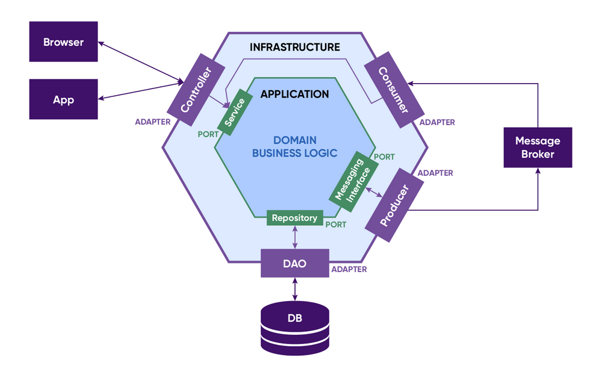

# Hexagonal Architecture - 헥사고날(육각형) 아키텍처

각 계층에서 하던 일들을 "내부와 외부" 라는 개념으로 나누어 각각에 맞는 별도의 인터페이스를 정의
- 이를 어댑터와 포트로 정의

---
- **"내부"의 로직은 오직 "외부"를 통해서만 접근 가능**
  - 모든 외부 시스템과의 직접적인 상호작용 : **어댑터** 의 역할
  - 각 서비스에서 비즈니스 로직에 맞게 정의된 인터페이스 : **포트** 의 역할
  - 즉, 외부 서비스와의 상호작용(어댑터) 는 비즈니스 로직과의 작업을 정의한 인터페이스(포트) 랑만 서로 통신

---
- 모든 비즈니스 로직은, 오직 외부에서 내부 방향으로 / 내부에서 외부방향으로만 호출이 가능
  - 인바운드 어댑터 -> 인바운드 포트 -> 비즈니스 로직
  - 비즈니스 로직 -> 아웃바운드 포트 -> 아웃바운드 어댑터

## 어댑터와 포트

### 어댑터 (Adapter)
- 서비스의 입장에서 이 서비스가 사용하는 외부 시스템과의 직접적인 **구현** 및 상호작용을 처리
  - e.x.
    - 외부 시스템(UI)으로부터 들어온 Request가 가장 처음 만나는 Controller는 **"인바운드 어댑터"**
    - 메세지 브로커(Kafka)로부터 Consume 하는 동작을 처리하는 로직 핸들러는 **"인바운드 어댑터"**
    - DB(MySQL ..)에 직접적으로 접근하여 다양한 작업(CRUD)을 처리하기 위한 DAO는 **"아웃바운드 어댑터"**

### 포트 (Port)
- 비즈니스 로직 입장에서 어댑터와 통신하기 위한 동작을 정의한 **인터페이스**
  - e.x.
    - Controller 로부터 들어온 요청으로부터 특정 비즈니스 로직을 수행하기 위한 동작을 정의한 인터페이스
    - Consume 한 메세지를 처리하기 위한 비즈니스 로직의 동작을 정의한 인터페이스
      - -> "인바운드 포트"
- 비즈니스 로직에서 DB 접근을 위해서 정의한 Repository 인터페이스는 **아웃바운드 포트**

## 도식화된 헥사고날 아키텍처

- 아답터를 통해 **외부 서비스의 의존성을 분리**하여 언제든 쉽게 교체하여 유연한 확장성 있는 대처를 하고, 
- 언제든 **쉽게 교체하여** 유연한 확장성 있는 대처를 하고,
- 포트를 통해서 내부 비즈니스 로직과 인터페이스를 분리하여 내부 로직의 구현은 인터페이스와 무관하게 개발 가능하도록!
- 물론, 코드의 양이 많아지고 불필요하다고 생각 되어질 수도 있지만
  - 결국 목적은? 
  - **유연성과 확장성** -> MSA와 찰떡궁합!

> MSA = 다수의 Micro Service의 소프트웨어 아키텍처의 모음
> MSA의 최대 목적인 비즈니스 케파를 만족하기 위한 Key는 빠른 확장성과 유연성
> MSA를 이루는 각 Micro Service도 높은 확장성과 유연성이 필수적!
> 
> Hexagonal Architecture는 MSA 환경에서 매우 적절한 Software Architecture!

