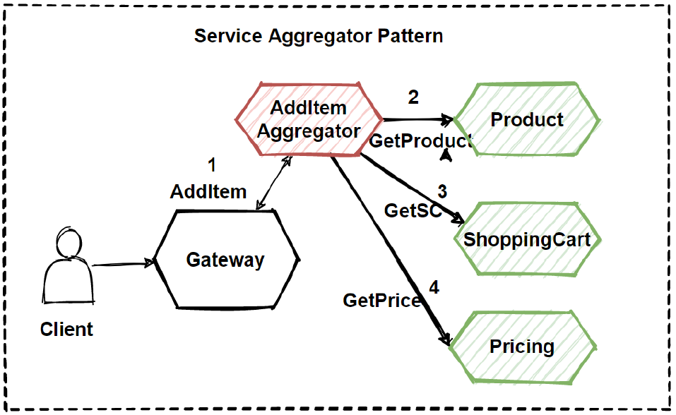

# 기능구현후 발생할 수 있는 문제상황

## MSA의 태생적인 한계

- 모든 서비스는 각 프로덕트로서, 도메인을 책임짐
  - -> 서비스 / 도메인 간 협업과 디펜던시가 지양됨 
- 각 서비스의 DB는 각 서비스를 통해서 접근해야만 한다 (데이터 오너십)

**여기서 생기는 문제**
-> 여러 서비스의 데이터를 Join 하고 싶으면..?

## 지금까지의 Query(Get) 성격의 API 특징 
- 모두 각 서비스의 오너십이 존재하는 데이터만을 요청하기 위한 Query였다
  - 즉, 지금까지는 모놀리스 기준 DB Table간 Join이 필요한 경우가 없었다!

- 필요하다면, **각 서비스에 여러번 데이터를 요청해서 필요한 정보를 사용!**
  - (e.x. Payment -> get Membership, get MemberMoney...)

## 그렇다면 이런 Query(서비스에 여러번 요청)들로 모든 비즈니스 요구사항들을 만족시킬수 있을까?

- 적은 부하, 적은 데이터량 등에서는 괜찮다!
  - 수만 건 ~ 수십만건 수준의 데이터는 API를 통해 필요한 작업을 수행해도 괜찮다!

- e.x. 특정 기간 동안, "충전"이 동반된 일정 금액 이상의 "송금" 내역의 합을 알고 싶다면 어떻게 해야할까?
  - (머니 충전 내역 DB에, 송금 시도 건에 대한 ID가 존재한다고 가정)

### 그냥 데이터 조회해서 처리하면 되지 않나요? - API Aggregation Pattern
- API로 여러개로 가져와서 aggregation 한 정보를 만드는 것을 API Aggregation Pattern!
- 그냥 처리할 수도 있다!
- 대용량 데이터가 아니고, 실시간 부하가 크지 않다면, 조회해서 비즈니스 로직을 만들어도 괜찮아요!

#### API Aggregation Pattern 주의할점!

1. **비즈니스 로직이 포함된 API의 호출 빈도를 파악해야함**
   - 너무 자주 호출되는 경우라면, Aggregation을 위한 각 서비스의 API가 부하를 받기 어려울 수 도 있다.
   - 대용량의 DB인 경우, 추가적으로 호출되는 API로 인해 DB의 부하 또는 **다른 서비스들에 장애를 전파시킬 수도 있다**
     - 서킷 브레이커 패턴 : 이름과 같이 과부하가 걸린 전기를 자동으로 차단해서 전기 사고를 방지하는 회로 차단기와 비슷하게 동작

2. **Aggregation API의 중요도**
   - 여러번의 API 호출 중, 한 번이라도 실패 시 그 호출은 실패가 되어야함
   - 그리고 여러번의 호출로 인해, 다른 서비스 API 보다 훨씬 긴 Latency를 가지게 될 것
     - N번 호출 + 내부 로직 실행 시간 

##### API Aggregation Pattern 

- 쉽고, 직관적이다 라는 아주 큰 장점이 있다!
  - 다만, 그만큼 주의해야 하고, 전체 시스템의 영향도를 꼭 파악해야만 하는 까다로운 패턴 중 하나 

