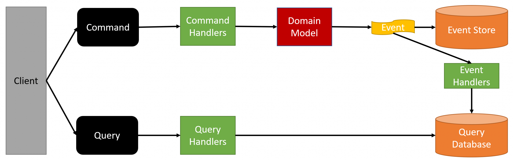

# 여러 도메인이 필요한 API를 위한 데이터 쿼리 패턴

## Command 와 Query를 분리하는 (CQRS 패턴!)

- 비즈니스 로직이 포함된 API를 위해서 이벤트를 활용하여 
- Command(데이터의 변동)와 Query(데이터 접근)을 분리했고, 
- 이런 장점을 활용해서 여러 요구사항을 충족 시킬 수 있다!
  - **이러한 패턴을 CQRS 패턴!** (Query를 위한 별도의 서비스 식별!)

## 여러 도메인이 필요한 API를 위한 데이터 쿼리 패턴 결론
- 모놀리스 환경에서는 비즈니스 로직이 포함된 API를 구현하기 위해 SQL Join을 활용
  - 그러나, **MSA 환경이 되면서 다른 DB를 활용하게 되어 Join이 불가능해졌다**
- 이런 문제 해결을 위해
- 가장 간단한 해결 방법으로, API Aggregation, CQRS Pattern이 무엇인지 배웠다
- API Aggregation Pattern은 직관적이고 간단하지만, **신경써야할 부분이 많다!**
- CQRS 패턴은 Query와 Command를 분리하는 패턴으로 **구현은 조금 어렵지만**, 많은 부분의 해결이 가능해졌다!

# 비즈니스 로직이 포함 된 API 식별하기 
- MSA의 근본 특성 (비즈니스 케파)를 다시 한번 생각해보며
- 모든 선택은 "요구사항"과 "목적"을 우선으로 하되, 현재의 상태를 종합적으로 고려해야함!
  - 앞서, 아래 케이스를 포함해서, 현재 패캠 페이의 문제를 식별할 수 있었다!
- 그리고, DB의 부하나 여러 상황들에 제약이 없다면, 충분히 API Aggregation Pattern 을 고려할 수 있다
- 다만, 데이터 쿼리를 위한 2개의 패턴(API Aggregation, CQRS)의 직접적인 비교가 어려워서, 
- 실습을 위해 동일 목적의 비즈니스 로직이 포함된 API를 2가지 패턴으로 모두 구현할 예정!

