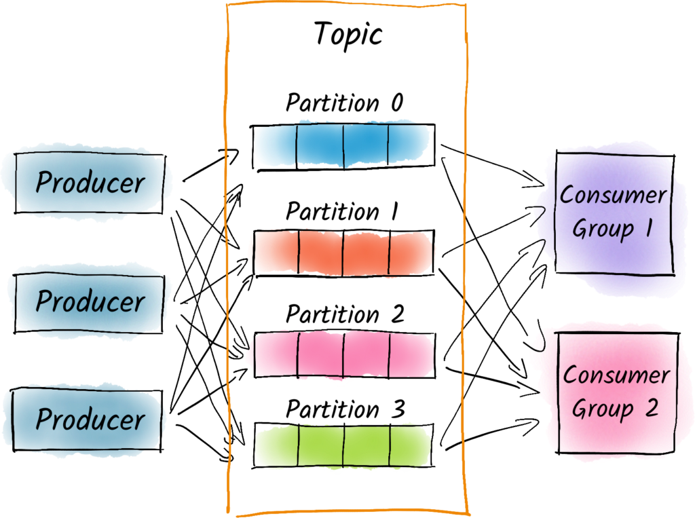

# kafka Topic 설계시 유의 사항

## Kafka Topic 이란?
- 메세지를 발행하고 소비할 수있는 "객체" (Object)
- "~ 토픽에 Produce 된 메세지를 Consume 하여 처리한다."
- Kafka Topic은 고가용성, 고성능을 구현하는 핵심개념
- Kafka Topic 에 존재하는 **수많은 설정 값들** -> 성능, 가용성에 엄청난 차이를 불러 일으킬 수 있다
  - **즉, 비즈니스에 따라 Topic의 설정은 완전히 달라질 수있다.**
- Kafka Topic 내 설정들이 어떤것을 의미하는지 **이해**할 수있다면! 적절한 Topic 설정이 어떤 것인지 **판단**가능!

### Kafka Topic 개념 1 (파티션, Partition)

- 메세지를 발행/소비 하는 객체로서, 수 많은 설정 값들이 존재
- 먼저, Topic 설정을 이해하기 위해서는 **Topic을 이루는 Partition에 대해 이해가 필요**

---
- Topic 은 1개 이상의 Partition으로 이루어져 있다.
  - Partition이란, 하나의 토픽에 포함된 메세지들을 물리적으로 분리하여 저장하는 저장소
    - 하나의 메세지를 분리시켜서 저장하는 것이 아닌,
      - **하나의 메세지가 하나의 파티션에 들어가는 형태**
        - **Not Sharding, Partitioning!**
      - 많이 분리할 수록 
        - -> **많은 물리적 리소스 활용 가능!**
      - Partition 이 많으면, 
        - -> **성능 향상! (일반적으로)**

- 하나의 Producer가 메세지 하나를 발행했을 때 들어가게 되는 저장소! 
- 하나의 파티션단위로 Consumer Group 이 묶이기 때문에 
  - 이 토픽의 처리량은 높다!

> 파티션은 (일반적으로) 성능과 직결되는 요소!

##### 참고 : 파티션을 늘려도 성능이 증가되지 않은 경우
- 만약 파티션4개가 포함된 Topic이 하나의 Broker에 들어가있다면, 
- 파티션을 더 늘려도, 처리량이 비례적으로 늘어나지 않을 가능성이 높다!
  - Broker 하나의 리소스가 제한적이고 한정적이기 때문, 오히려 역효과가 날 수 도 있다.

- 여러개의 파티션이 하나의 Broker에 들어가 있으면 별로 효율적이지 않을 가능성이 높다

### Kafka Topic 개념 2 (파티션 갯수와 성능)
- 하나의 Partition은 하나의 Kafka Broker 에 소속됨 (1:1)
- 하나의 Kafka Broker는 1개 이상의 Partition 을 가지고 있다 (1:N)
- Partition 갯수가 많다고 해서, Kafka Broker 갯수가 많은 것을 의미하지는 않는다.
  - 즉, Partition 갯수가 절대적인 성능의 결정 요소는 아니다 

**하나의 물리적인 Broker 퍼포먼스에는 한계가 있으니까**

### Kafka Topic 개념 3 (Partition 과 Partition Replica)
- 토픽의 설정에 있어서 그 토픽은 몇개의 파티션을 가지며 각각의 파티션은 몇개의 복제본이 있니 라는 개념을 **Replication Factor** 
- 파티션의 Replication Factor는, 가용성을 위한 개념
- 하나의 파티션 에는 , Kafka Cluster 내에 **1개 이상의 복제본(Replica)**을 가질 수 있다
  - RF(Replication Factor)는 이 복제본의 갯수를 의미 ( RF >= 1)
- 즉, RF 가 1보다 큰 수치를 가져야만 **고가용성을 달성할 수 있다**
  - 일반적으로 클 수록, 가용성이 높다고 말할 수 있다. 
  - 물론, **Broker 갯수가 충분할때** 한정
- 그러나, 너무 크면 메세지의 저장 공간을 낭비 할 수 있다.
- 그리고, Produce 할 때에도, 지연시간이 길어질 수 있다. 

### Kafka Topic 개념 4 (ISR, In-sync Replica)
- Sync 가 되었다고 판단 가능한 레플리카 그룹

- Partition의 복제본이 많아지면 (RF가 커지면) 가용성이 늘어난다
  - 그리고 'Produce' 시에도 복제해야할 데이터가 늘어난다
- -> **Produce 시의 지연시간이 길어질 수 있다.**
  - 하지만, 그럼에도 지연 시간은 짧게 유지하고 싶다면? 

---
- sync -> 복제본들이 동기화 되었다는 의미 == 복제되었다.
- ISR 그룹이란, 하나의 파티션에 대한 Replica 들이 동기화된 그룹을 의미
  - -> ISR 그룹에 많은 파티션 포함
    - -> Produce 신뢰성/가용성 향상, 지연시간 증가
  - -> ISR 그룹에 적은 파티션 포함
    - -> Produce 신뢰성/가용성 하락, 지연시간 감소

- 적절하게 토픽에 Produce 되었다
  - -> 토픽 내 파티션의 모든 ISR 그룹에 복제 되었다.

# Kafka Topic 설계시 유의할 것들 (고려해야 할 것들)
- **전제 : 충분한 kafka Broker 갯수**

1. **토픽에 포함된 파티션 갯수 (Partition Number)**
  - 일반적으로 퍼포먼스와 연관

**"Topic을 사용하기 위한 일꾼들"**

2. **토픽에 포함된 파티션의 복제본 갯수 (RF, Replication Factor)**
  - 일반적으로 가용성과 연관

**"Produce 시, 정상적으로 "Replication"가 되었다."**

3. **토픽의 ISR 그룹에 포함된 파티션 그룹 (ISR, In-sync Replica)**
  - 일반적으로 Produce시의 지연시간, 신뢰성과 연관

**"Replica들이 정상적으로 "Sync" 가 되었다."**

## 결론 
- kafka는 대규모 이벤트/데이터 스트리밍 플랫폼 실시간성
- 대규모 분산 처리 환경에서 적합한 선택지
  - 하지만, 높은 러닝 커브와 카프카 클러스터 운영을 위한 전문 인력들의 필요성
  - 그럼에도 잘사용한다면 신뢰성/가용성/성능 면에서는 최고의 효율
- 잘 사용하기 위해서는 "토픽"을 이루는 **파티션과 관련된 설정들의 "이해" 필요**
- 비즈니스의 특성에 따라, 인프라 환경에 따라서 **적절한 설정값들을 "판단" 필요**

