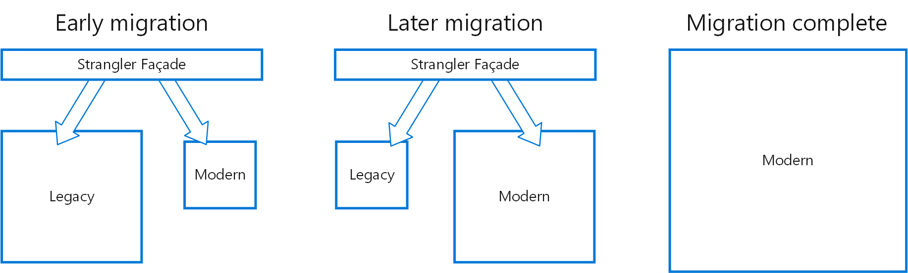
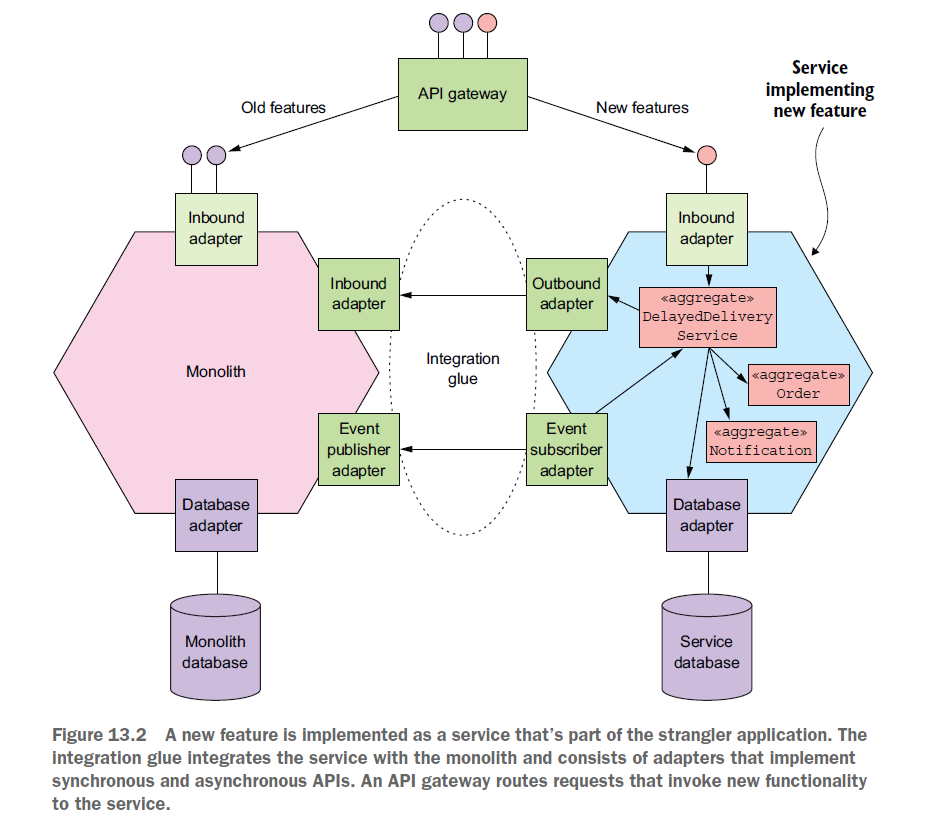

# 분해 과정에서 서비스 운영 

- 모놀리식에서 MSA로 전환을 위해 고려해야할 것들을 해결 == 마이그레이션
  - "완전히 뜯어 고친다는 것"이 보장 하는 것은 "전부 다 뜯어 고친다"는 사실 뿐 (마틴 파울러)
- **서비스 단위로, 하나씩 하나씩 분해하며 소프트하게 전환하는 방법**을 알아보자

## 스트랭글러 패턴 
- 덩굴 패턴?

### 스트랭글러 패턴 - API Gateway

- 모놀리식 어플리케이션에서 일부를 마이크로 서비스로 바꾸고
- 기존에 호출하던 API Gateway에 새로 만든 마이크로 서비스로 요청을 보내는 것

### 스트랭글러 패턴 - 통합 글루 1

- 모놀로식 DB를 Micro Service DB로 마이그레이션이 목적
- 모놀리식 어플리케이션에서 마이크로 서비스로 바꾸고 
- 기존의 모놀리식 어플리케이션과 마이크로서비스 사이의 통합 글루라는 통로를 만들어 주는 것 
  - 그리고 기존 모놀리식 DB에 데이터를 업데이트 시키기 위해 비동기 큐로 이벤트 발행하여 모놀리식어플리케이션에 보내줌 

### 스트랭글러 패턴 - 통합 글루 2

- 기존의 모놀리식 어플리케이션의 서비스에서 분리한 MS가 혼자 독립적으로 처리 가능하다면,
- MS에 해당하는 API 통신을 모두 MS 로 보낸다
- MS DB와 기존 모놀리식 DB가 직접 동기화 한다. 

## 결론
- 전환을 비롯해 새롭게 구축하는 상황에서조차, 물리적인 한계로 "분해"가 어렵다는 것은 알았다.
- 그리고 이런 한계들들, 다양한 패턴들을 통해 극복 가능하다는 것도 알았다
- 물론 잊지 말아야할 것은, 이 패턴들을 구현하는 것도 모두 시간과 비용이 필요하다
  - 한계 : 네트워크 지연, 트랜잭션, 가용성

---
- 이렇게 극복한 패턴들을 이용해서, 기존에 운영중인 모놀리식으로부터 MSA로 전환하는 방법도 알아봤다.
  - 스트랭글러 패턴과 통합 글루
