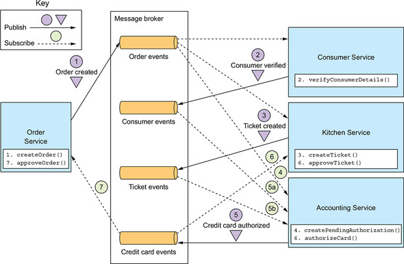
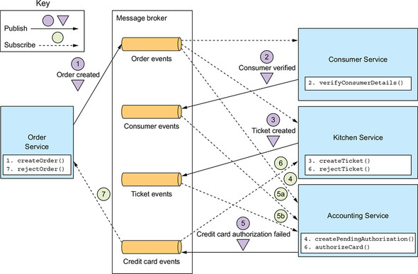

# SAGA 패턴

- **이벤트 방식(Async, 큐잉)** 으로 **트랜잭션에 포함된** 여러 작업 (각 서비스의 API Call)의 결과를 게시하고, 
- 이벤트를 비동기 처리하여 다음 작업들을 진행
  - 실패시 역순으로 보상 트랜잭션 작업을 호출한다면?? (Undo)
    - e.x. 트랜잭션 예시 : 작업1 -> 작업2 -> 작업3 -> 작업4 가 하나의 트랜잭션으로 묶인 경우

#### 정상적인 상황 
- 정상적으로 작업1을 실행 후 "성공" 이벤트를 개시
- consume 후, 다음 서비스가 정상적으로 작업 2을 실행
- consume 후, 다음 서비스가 정상적으로 작업 3을 실행
- consume 후, 다음 서비스가 정상적으로 작업 4을 실행
- 작업 4 정상 "성공" 이벤트를 게시  **-> 여기서 보통 고객에게 OK 응답 내림**
- 작업 3을 진행한 서비스가 consume, 작업 3 "성공" 이벤트 개시 
- 작업 2을 진행한 서비스가 consume, 작업 2 "성공" 이벤트 개시 
- 작업 1을 진행한 서비스가 consume, 작업 1 "성공" 이벤트 개시 -> 트랜잭션 완료

### 우리 페이에서의 송금 서비스 예시 

- 송금 시작 이벤트 (**머니 서비스 작업 시작**) 게시
- -> 머니 컨슘 
  - 잔액이 충분한지 아닌지 처리 후 
  - 결과 이벤트 게시
    - -> 뱅킹 컨슘, 펌뱅킹 실행
      - 이벤트 결과에 따른 처리 후 결과 게시
        - -> 머니 컨슘
          - 정상이라면 잔액 증가 
          - **실패라면? 이때는 어떡하징**

## SAGA 패턴의 종류 
- Saga 패턴을 구현하는 방법에는 크게 2가지 

### 코레오그레피 (Choreography) 패턴
- 독립적인 조율자 (Ochestrator)를 두지 않고, Saga를 구현하는 방법
- 구현이 비교적 간단하지만, **트랜잭션 상황을 모니터링 하기 어렵다는 단점**
- 비즈니스가 조금이라도 복잡하면 선택 X 

#### 코레오그래피 패턴 적용 시 주의할 점과 특징 

- **이벤트를 Publish(Produce) 하는 작업이, 내부 서비스의 트랜잭션과 하나로 묶여야 한다**
  - 그렇지 않으면, 내부 (각 서비스 로컬)데이터의 변경을 위한 작업 이후 정상적으로 이벤트가 발행되지 않을 수 있다

- **각 서비스의 입장에서는 구현이 단순! 복잡도가 낮다**
  - 각 서비스 입장에서는 사전에 정의된 이벤트만 받고, 정의된 이벤트만 보내면 되기 때문!
    - 그러나, 복잡한 비즈니스가 될 수록 전체적인 트랜잭션의 상태나 Saga의 정의에 대한 분석과 유지보수가 어려워질 수 있다!

### 오케스트레이션(Orchestration) 패턴
- 독립적인 조율자(Orchestrator)를 두어, 하나의 Saga(트랜잭션)에 대한 매니징을 담당하는 방법
- 구현이 비교적 어렵지만, **비교적 전체적인 트랜잭션의 모니터링이 수월하다는 장점**

#### 오케스트레이션 패턴 적용 시 주의할 점과 특징

- **추가적인 인프라(오케스트레이터)가 필요하기 때문에, 이를 관리하기 위한 대책이 동반되어야 함**
  - 섣부른 적용은, 오히려 독이 될 수 있다

- **각 서비스에서의 구현은 비교적 간단해지고, 보상 트랜잭션만 구현하면 된다**
  - 관심사 분리 측면에서 유지보수 효율성이 올라간다
    - 사가에 대한 정의와 상태에 대한 모니터링은 오케스트레이터에서!
    - 각각의 서비스, 주체에서 각각 보상 트랜잭션만 잘 구현하면 됨!

- **트랜잭션에 대한 비즈니스 로직이 오케스트레이터에 포함될 가능성이 있다!**
  - **매우 경계해야할 부분**
  - 사가 오케스트레이터는 그냥 각각의 응답을 받으면 스태틱하게 넘겨주기만 하면됨!

## 결론 
- **Saga 패턴이란, 기존의 2PC/보상 트랜잭션의 부족한 부분을 보완하는, MSA환경에서 트랜잭션을 구현하기 위한 패턴!**

- **Saga를 구현하는 방법에는 코레오그래피 패턴과 오케스트레이션 패턴이 있다!**
- **각 패턴은 비즈니스의 복잡도, 그리고 인프라, 인력 등 많은 부분을 고려해야 하고,**

> 가장 좋은 방법은 트랜잭션을 구현하지 않는 방법을 찾는 것!

