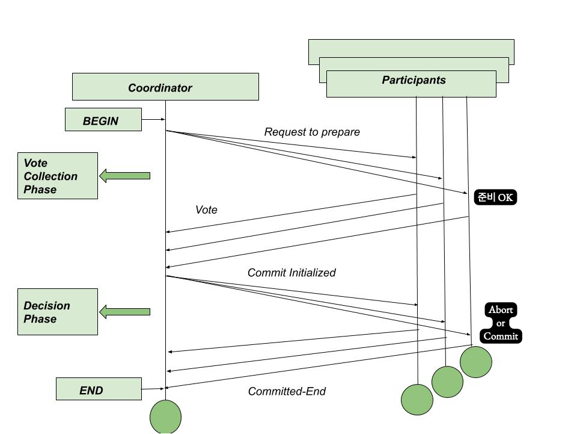
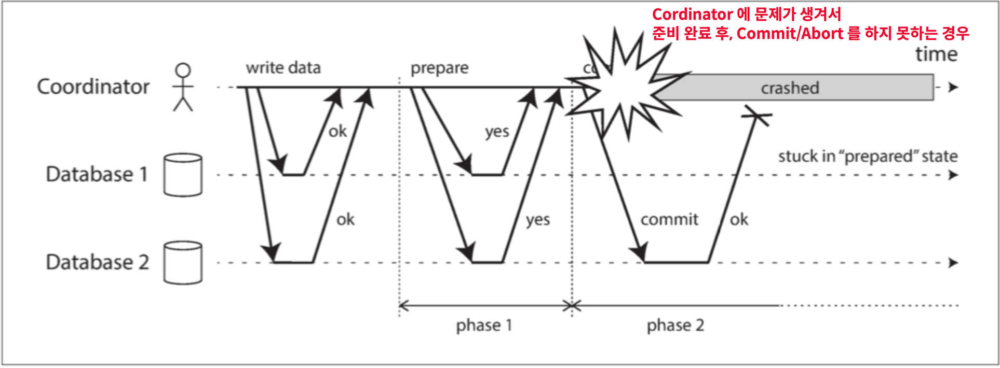

# 분산 시스템 환경에서 트랜잭션을 유지하기 위한 방안

# 1. 2PC (2 phase Commit)
- 처음엔 다수의 노드를 가지는 데이터베이스에서 커밋을 구현하기 위한 개념으로 시작 됨 
- 의미가 확장되어, 분산시스템(다수의 노드) 환경에서 트랜잭션을 구현하기 위한 해결방안 중 하나

---
- 2 Phase Commit은 하나의 약속 규약(프로토콜) 이라고 볼 숭 ㅣㅆ다.
  - 2PC를 위해서는 분산 시스템 환경에서 **Cordinator 라는 추가적인 요소(인프라)가 필요**
  - 그리고 트랜잭션을 위한 서비스들을 **Participant(참여자)** 라고 정의
    - 2 Phase는 각각 다음과 같아요
      - **Prepare** (phase 1) 준비
      - **Commit** (phase 2) 커밋
  - **Cordinator(조정자)** : 분산 트랜잭션을 위해 **데이터 변경을 수행하는 서버(MSA환경에서 각 서비스)들의 Phase를 관리**

## 2PC가 구현되는 프로세스 
--- Start "**Prepare**"
1. 트랜잭션이 시작되면.. Cordinator 가 Global Unique ID (Transaction ID) 를 생성해요.
2. Cordinator 는 사전에 정의된 각 서비스(Participant) 별로 실행해야 할 요청들에 대한 **준비를 각 서비스에 요청해요.**
3. 모든 Participant 가 준비 되었다고 응답받아요. (실질적 데이터 변경은 일어나지 않은 상태)
 
--- **"Prepare" Done**, **"Commit" Start** ---
4. Cordinator 는 Participant(참여자)들에게 Commit 요청을 해요.
5. Participant 들은 이전에 준비했던 동작을 마저 진행하고, 각 서비스들은 실제 데이터 변경을 위한 Commit 을 진행해요.
6. 모든 Participant 에게 OK 응답을 받게 되면, 트랜잭션이 완료 되어요.
   
--- "Commit" Done ---

- 만약 참여자 중 나머지가 commit 할때 까지 **데이터에 대한 Lock**을 걸어야됨!
- 그럼 장애에 대해 취약하다!

## 2PC의 한계 - 장애 취약성 

1. **Cordinator에 모든 트랜잭션의 의존성이 있다.**
   - Cordinator에 문제가 생기는 순간, 모든 트랜잭션은 멈춰버리고 **모든 비즈니스가 정지**
   - **Data에 대한 Lock이 걸린다.**
   - 문제가 생기면 결정 주체가 없어짐 (wait or timeout)

2. **Cordinator의 모든 결정은 취소 불가능**
    - Commit /Abort 결정에 대해서는 그 사이에 어떤 문제가 생겼을지라도,
    - 어떤 방법을 써서라도 완료 해야만함
    - **트랜잭션의 정합성(일관성)이 깨질 수 있다**

# 2. 보상 트랜잭션 (Compensating Transaction)

#### DBMS 에서의 보상 트랜잭션
- 일련의 작업을 보상(보정)하기 위한 트랜잭션을 구현하기 위한 하나의 방법
- 개념 자체는 고전적인 데이터베이스 개념에서 따왔다.
  - "commit"된 데이터를 **"commit" 되기 이전의 상태로 변경하기 위한 작업**
    - 데이터 베이스 개념 상으로 작업(do)하던 내용을 다시 Undo 할때, "보상"(Compensate)라는 용어를 사용

      - DB 에서 작업 기록을 볼 수 있는 기록 이 있다 (Do Log)
      - 이를 역으로 undo 할때는 보상 로그 레코드(CLR, Compensating Log Record)

## MSA 환경에서의 보상 트랜잭션
DBMS 기준
- "commit" 된 데이터를 "commit" 되기 이전의 상태로 변경하기 위한 작업

**MSA**
- "commit" 된
  - **데이터 변경을 수반하는 요청이 정상적으로 종료된 서비스의**
- 데이터를
  - **API 호출에 대해서**
- "commit" 되기 이전의
  - **그 데이터 변경 요청을 하기 이전의**
- 상태로 변경하기 위한 작업
  - **상태로 되돌리기 위한 API**

### 우리 페이 시스템에서 보상 트랜잭션이 필요하다면? 
1. 머니가 부족해서 펌뱅킹으 통한 충천후 (뱅킹 svc)
2. 타켓 대상의 머니 잔액 DB Update 실패시 (머니 svc)
3. 펌뱅킹의 상태를 되돌리는 작업 (API, to -> from 송금 요청)

**하지만, 엔지니어링과 비즈니스는 별개**

### 보상 트랜잭션의 한계 - Sync 방식의 한계

1. 머니가 부족해서 펌뱅킹으 통한 충천후 (뱅킹 svc)
2. 타켓 대상의 머니 잔액 DB Update 실패시 (머니 svc)
3. 펌뱅킹의 상태를 되돌리는 작업 (API, to -> from 송금 요청)

- 이런 보상 트랜잭션을 요청했는데, 이 API가 의도치 않게 길어지게 되면, 고객은 계속 로딩중,,,

# 결론 
- 2 Phase Commit
  - 2단계 (Prepare, Commit)에 걸쳐서 트랜잭션을 구현
  - **한계**
    - Cordinator에 전적으로 의존해야하는 한계 존재
    - 데이터 Lock으로 인한 가용성 한계

---
- 보상 트랜잭션 (in MSA)
  - 데이터의 변경을 일으키는 요청을 그 이전 상태로 되돌리기 위한 요청 (API)
  - **한계**
    - 보상 트랜잭션 요청에 지연 혹은 실패, 문제가 생기는 경우, 보상 트랜잭션을 호출하는 주체는 명확한 판단이 어려움

> 어느것을 선택할지 항상 무조건 맞는 답은 존재하지 않는다.
> 
> **모든것은 비즈니스 목적이 1순위**