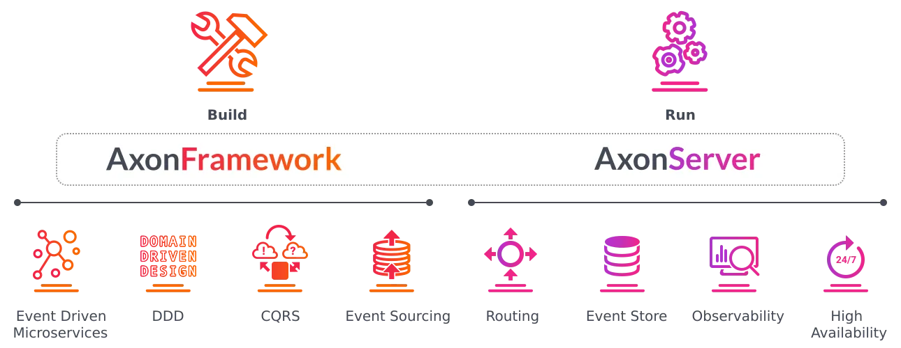

# 이벤트 소싱과 EDA

### Async 패턴, Saga 패턴의 공통점 

- 비동기 통신 방식을 사용해요.
- 메시징 브로커를 사용해요
- -> Event 를 발행(Produce)하고, 비동기 방식으로 필요한 곳에서 Consume 해요.

##### 그렇다면 Event의 특성은? 
발행(Produce)이라는 행동은, 비교적 성공률이 굉장히 높다 (누락될 가능성이 거의 없다)

하나의 독립된 표지판 같은 역할로서, Event 자체만으로는 그 어떤 도메인과도 직접적인 의존성이 없다.

느슨한 결합을 가능하게 만들어준다.

### 그런데 일반적인 MSA 환경에서 Sync 방식의 서버와 RDB를 사용하다 보면  (SAGA 패턴을 모른다는 가정)
- DB가 불안정해서 빈번하게 CRUD 요청에 실패하기도 한다.
- 서버의 리소스가 부족해서/ 불안정해서, 빈번하게 요청자체를 못 받는 경우도 생긴다. (e.x.conn poll, idle timeout)
- 서비스 간 호출이 재시도 되면서, 예기치 못한 문제가 발생하기도 함 (네트워킹, JVM 최적화 어려움)
- 이렇게 실패하는 요청들은, 이후 access log, 혹은 gateway 레벨에서의 로그 등을 확인하고,
  - 데이터의 정합성을 맞추는 작업이 추가적으로 필요!

### 그렇다면 위의 어려움을 Event 를 통해서 해결해보자
즉, 모든 데이터의 변경을 의미하는 작업들에 대해서 최종적으로 변경된 정보 (RDB)만 바라보는 것이 아니라 

**그냥 마지막에 수신한 Event 를 기준으로 특정 도메인 데이터의 정합성을 유지해 볼 수도 있지 않을까?**

기본의 방식 : **데이터 영속화 방식**

새로운 방식 : **Event Driven** 방식 (using event Sourcing)
- 이벤트 소싱을 통해서 모든 데이터의 변경을 관리하고, 이벤트를 통해서만 변경할 수있는 방식 
- 이벤트를 기준으로 모든 데이터의 변경을 처리하고, 조회한다.

#### 데이터 영속화 방식의 특징 (일반적인 형태)

##### 데이터의 변경
- 하나의 도메인(DB)을 특정할 수있는 Key를 조건으로, 포함된 정보를 변경
  - e.x. id가 3인 고객의 주소 정보를 관악구에서 서초구로 변경해줘

  - 이전에 가지고 있던 "관악구"의 정보는 사라짐
    - 이전의 정보는 관심 X
    - 중요한 경우, 별도의 장치(로깅)을 통해 구현

##### 데이터 조회
- 하나의 도메인(DB)을 특정할 수 있는 Key 를 조건으로 , row 정보를 모두 조회 

> 데이터 영속화 방식의 특징
>
> 서버, DB에 문제 발생 시 특정 요청에 대해 rollback이 된 상태로, 재시도 등의 대처를 해야만 함

# Event Driven 방식의 특징 

##### 데이터의 변경
- 하나의 도메인(DB)을 특정할 수 있는 **Key와 변경 정보가 담긴 이벤트를 발행(Produce)**
  - e.x. (동기) : 사용자 -> ((주소 변경 요청)) -> membership svc -> 변경 요청 Event 발행 -> (사용자 응답 완료)
  - e.x. (비동기) : membership svc -> 변경 요청 Event 소비(Consume) -> 도메인의 최종 Version 정보를 변경

##### 데이터 조회 
- 하나의 도메인(DB)을 특정할 수 있는 Key를 조건으로, 최종 Version 정보를 조회

> **Event Driven 방식의 특징**
> 
> 장애나 서버, 인프라에 문제가 발생할 지라도, 앱이 복구되면, 메세지 브로커(이벤트)에 의존해서 일관성(트랜잭션)을 구현할 수 있다!
> 
> 마치, DBMS에서 REDO/UNDO 로그를 사용하는 것 처럼!

## Event Driven 방식 

- 비동기 방식의 특성과 자원을 더욱더 효율적으로 사용할 가능성이 높아진다 

# Event Driven Architecture (EDA) - MSA 의 단점을 보완
- 모든 데이터의 변경과 조회를 이벤트를 기반 (Event Driven)
- **즉, 비즈니스를 이벤트를 기반으로 구현하는 방식**

### EDA를 이루는 요소 

## EDA의 치명적인 단점
- Event가 한번 잘못 발행, 또는 Consume 이후 잘못된 처리를 하는 순간
- 모든 데이터 정합성과 트랜잭션이 크게 망가질 수 있는 상황이 생길 수 있다
  - **백업, 통제 정책 등을 잘 수립해야만 해요**

  - -> 복잡한 비즈니스에서는 오히려 안 어울릴 수 있는 옷이 될 수 있다
  - -> 몇가지 Solution들이 존재 (e.x. Eventuate, Axon Framework)

> **Sync 방식을 유지하며, Infra와 DB Scale Up 등의 힘으로 유지하는 선택도 분명 하나의 선택지!**

## EDA의 도입이 합리적일 수 있는 경우

- 잘못된 한번의 Event 처리가 굉장히 큰 여파를 불러 올 수 있다.

  - **하지만, EDA를 도입하는 이득이, 그 이전의 고통보다 현저히 큰 경우**
    - e.x. 빈번하기 서버나 DB에서 Sync 요청에 대한 실패가 잦은 경우
    - Message Broker를 잘 이해하고, 관리할 수 있는 별도의 조직이 있는 경우
    - **각 도메인 데이터의 변경 History가 굉장히 중요한** 비즈니스의 경우
    - Event의 처리 혹은 Message Broker가 실패하더라도, 완벽한 fallback 정책이 구현된 경우

### EDA를 구현하는 솔루션 1- Eventuate
- EDA를 구현하기 위한 오픈소스는 아니고, 이를 활용해 EDA라고 칭해볼 수 있는 아키텍처를 구성할 수 있다!

- **Eventuate Local**
  - Event 를 기반으로, 하나의 서비스(Local) 환경에서 Event Sourcing 플랫폼 구현을 도와주는 오픈소스에요.
  - Event Driven Domain
- **Eventuate Tram**
  - 분산 데이터 환경을 도와주는 플랫폼 오픈소스로, Saga, CQRS 패턴 구현을 쉽게 만들어 주는 오픈소스에요.
  - Event Driven Platform for Distributed data management
  
- 2가지를 모두 사용해서, EDA 라고 칭해볼 수 있는 아키텍처를 구성해 볼 수 있어요.
- 공식 홈페이지: https://eventuate.io/

## EDA를 구현하는 솔루션 2- Axon Framework

Axon Framework
- 태생부터 DDD, CQRS, EDA 를 구현을 쉽게 하기 위해 개발된 오픈소스 프레임워크
  - 비교적 잘 정리된 문서들과 많은 레퍼런스 -> 우리의 선택 근거

> Axon based applications follow an architectural pattern which is based on the principles
of Domain-Driven Design (DDD), Command Query Responsibility Segregation (CQRS)
and Event-Driven Architecture (EDA).

- Apache 2.0 라이센스를 가지고 있어요. (상업적 사용 가능!)
  - 원문: https://www.apache.org/licenses/LICENSE-2.0

- **상업적 사용이 가능하며, 소스코드를 공개할 필요가 없지만** 배포시 **"Apache License 2.0 라이선스 사본 제공“**,
  ”수정된 파일에 대한 안내문구 첨부“, ”저작권, 특허, 상표, 귀속에 관한 고지내용 포함“등의 요구사항이 존재해요.

- 공식 홈페이지: https://docs.axoniq.io/reference-guide/architecture-overview

### Axon Framework 를 구성하는 요소
- Axon Framework는 기본적으로 별도의 오케스트레이터(조율자)가 존재

**Axon Framework**
- Event Sourcing 기반으로, 데이터를 관리할 수 있는 도구를 제공하고, 이 도구를 사용해서 CQRS, DDD를 구현할 수 있도록 도와줌
- Springboot 프로젝트에 의존성으로 사용하여, 다양한 어노테이션 기반으로 위 기능을 구현해 볼 수 있다.

**Axon Server**
- Axon Framework 를 사용하여 **배포된 어플리케이션들의 조율자 역할**
- Axon Framework 를 사용하는 어플리케이션들로부터 **발행된 Event 들을 저장하는 역할**
- 각 어플리케이션들의 **상태를 관리**하고, **embedding 된 큐잉을 내재하여 유량 조절도 진행**
- **고가용성에 집중된 내부 구현**이 되어있고, Observability(각각의 상태를 잘 볼 수 있게 해주는 기능) 를 제공

#### Axon Framework 자체를 구성하는 요소 

**Command Bus**
- Command 만이 지나갈 수 있는 통로
  - Command : 데이터를 변경시킬 수 있는 명령

**Command Handler**
- Command Bus로부터 받은 Command를 처리할 수 있는 Handler

**Domain, Aggregate**
  - based on **DDD**
  - **Aggregate** : Command를 할 수 있는 도메인의 단위

**Event Bus**
- Event 만이 지나갈 수 있는 통로 

**Event Handler**
- Event Bus로 부터 받은 Event를 처리하는 Handler

##### Axon Framework를 통해 구현하는 Saga 패턴

1. Axon Server를 구축 (Axon Framework's Orchestrator)
2. 각 서비스에 Axon Framework 의존성을 추가
3. Event Sourcing 방식을 사용해서, 기존의 Request-Response 모델을 Event Driven Model로 변경
4. 변경된 모델을 사용해서, Axon Framework가 지원하는 Saga 패턴을 구현 
   - **-> 자연스럽게 Orchestration 방식의 Saga를 비교적 간단하게 구현!**

# 결론

기존의 MSA에서 일반적으로 활용하던 Request-Response 모델 (Sync)에서 Event 라는 개념이 들어오면서

하나의 서비스에서 Event Sourcing 을 활용한 Event Driven 모델이 생겼다 

이 모델을 하나의 서비스 뿐만 아니라, 서비스 간 통신 및 트랜잭션 등에도 활용하면서 MSA 에서 조금 더 발전된 

Event Driven Architecture (EDA)가 등장했지만, 구현에 대해서 어려움이 많았다.

이를 해결하기 위해, 몇가지 솔루션이 등장했고, 그 중 하나인 Axon Framework 에 대해서 배워 보았다.

Axon Framework는 EDA 구현을 도와주고, DDD, CQRS, Saga 등을 쉽게 구현할 수 있도록 해줌!

 **Axon Framework를 활용해서, 일부 서비스를 Event Driven 모델로 변경하고, 이를 활용하여 Saga를 통한 트랜잭션을 구현해볼 예정**
 

